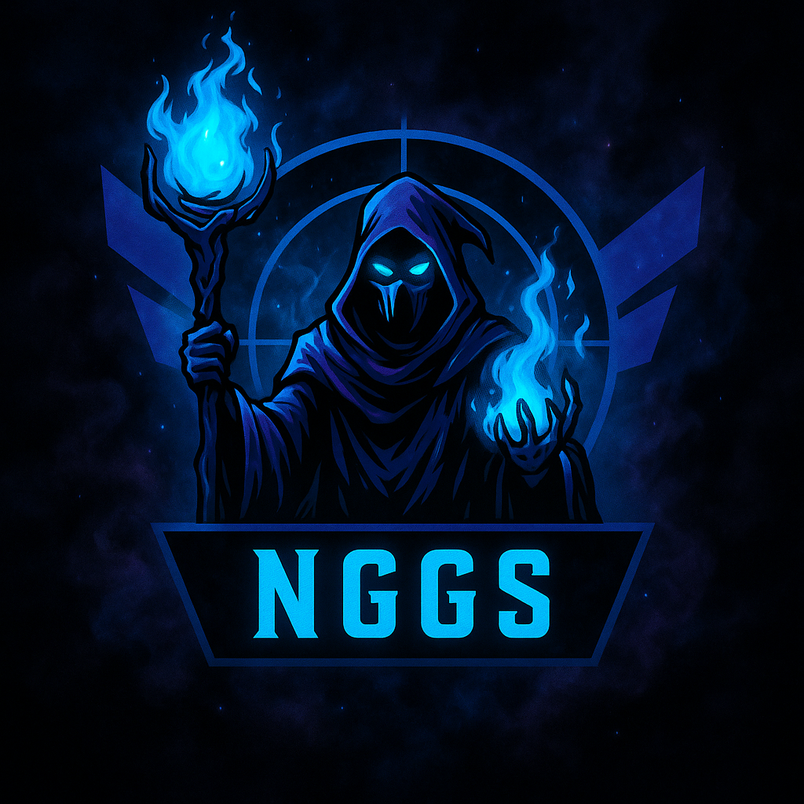

  

  

    
NGGS PERFORMANCE HUB

    <h1>Treine, otimize e jogue com ética.</h1>
    

      Guias oficiais da comunidade NGGS para extrair o máximo do seu setup de FPS sem abandonar o fair play.
      Ajustes consistentes para Windows, GPU, mouse e táticas reais de PUBG.
    

    

      <a class="md-button md-button--primary" href="comunidade/discord/">Entrar na comunidade</a>
      <a class="md-button md-button--ghost" href="#mapa-de-conteudo">Mapa de conteúdo</a>
    

    <dl class="nggs-hero__stats">
      

        <dt>FPS Estável</dt>
        <dd>+45</dd>
      

      

        <dt>Coaches NGGS</dt>
        <dd>12</dd>
      

      

        <dt>Guias curados</dt>
        <dd>30+</dd>
      

    </dl>
  

  

    
  

<section class="nggs-section" id="mapa-de-conteudo">
  <header class="nggs-section__header">
    Mapa tático
    <h2>Foque no que importa antes do drop.</h2>
    
Escolha por onde começar e siga as checklists com segurança: cada dica contempla reversão e impacto esperado.

  </header>
  

    <article class="nggs-card">
      
      <h3>Preparar o PC</h3>
      
Checklist de estabilidade, Windows afinado, armazenamento saudável e rede pronta para scrims.

      <a href="pc/checklist/" class="nggs-card__link">Ver checklist</a>
    </article>
    <article class="nggs-card">
      
      <h3>GPU sem surpresas</h3>
      
Perfis NVIDIA e AMD com foco em FPS consistente, sempre dentro das recomendações das fabricantes.

      <a href="gpu/nvidia/" class="nggs-card__link">Abrir guias</a>
    </article>
    <article class="nggs-card">
      
      <h3>Precisão de mouse</h3>
      
Fundamentos, testes práticos e nossa calculadora de eDPI + distância 360° integrada à CLI.

      <a href="mouse/calculadora/" class="nggs-card__link">Calcular agora</a>
    </article>
    <article class="nggs-card">
      
      <h3>PUBG playbook</h3>
      
Rotas táticas, anexos, modelo de arma e diretrizes de comunicação para squads NGGS.

      <a href="pubg/guia-geral/" class="nggs-card__link">Montar estratégia</a>
    </article>
  

</section>

<section class="nggs-section nggs-section--accent">
  

    

      Suporte NGGS
      <h2>Conte com a nossa equipe para evoluir no PUBG.</h2>
      

        Precisa de ajuda para otimizar o PC, configurar periféricos ou entender o meta atual? Nosso time está disponível
        para orientações em áudio, análises de partidas e ajustes personalizados.
      

      

        
<strong>Como funciona?</strong>

        <ul>
          <li>Solicite atendimento pelo Discord e informe seu objetivo (FPS, aim, tática).</li>
          <li>Receba um plano de ação com ajustes recomendados e como revertê-los quando necessário.</li>
          <li>Agende sessões adicionais para feedback contínuo até alcançar seu desempenho ideal.</li>
        </ul>
        <a class="md-button md-button--primary" href="comunidade/discord/">Quero orientação agora</a>
      

    

    

      
      

        Nosso suporte personalizado mantém o foco em configurações legítimas e respeito às regras. Você recebe dicas
        práticas, checkpoints de reversão e acompanhamento direto dos coaches NGGS.
      

    

  

</section>

<section class="nggs-section">
  <header class="nggs-section__header">
    Fair play acima de tudo
    <h2>NGGS é sinônimo de integridade competitiva.</h2>
    

      Reforçamos práticas legítimas em todos os guias. Nenhum ajuste aqui compromete os termos de uso de PUBG, Microsoft, AMD ou NVIDIA.
    

  </header>
  

    <article>
      <h3>Zero cheat</h3>
      
Sem no-recoil, macros ou automações. Se encontrar algo suspeito, remova e reporte ao staff imediatamente.

    </article>
    <article>
      <h3>Documentação reversível</h3>
      
Cada etapa explica como desfazer o ajuste. Segurança total para treinar, competir e fazer troubleshooting.

    </article>
    <article>
      <h3>Referências oficiais</h3>
      
Fontes da Microsoft, NVIDIA, AMD, Intel, Krafton e provedores confiáveis. Nada de gambiarras.

    </article>
  

</section>
